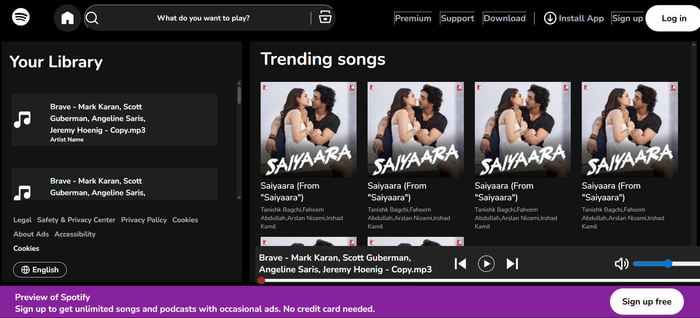
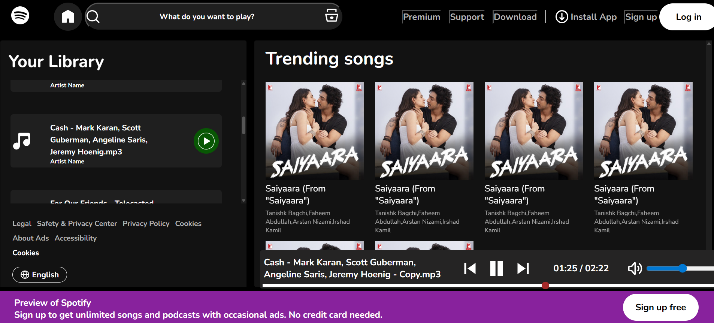
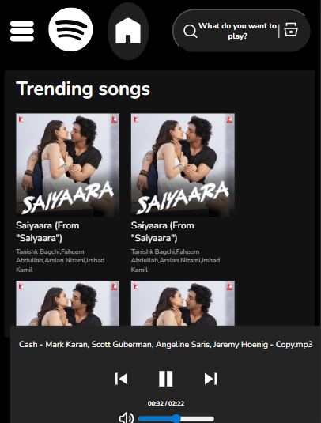
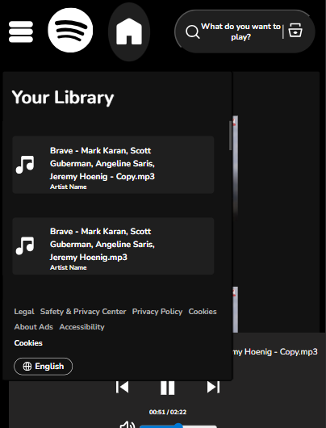

# 🎵 Spotify Clone  
**Spotify-inspired music player web application** built using **HTML5, CSS3, and JavaScript**.  
This project replicates core features of Spotify’s UI and basic audio controls, allowing users to play, pause, and switch between tracks.  

---

## 🚀 Features  
- 🎧 Play, pause, and stop music  
- ⏭️ Next & Previous track controls  
- 🎚️ Progress bar and seek functionality  
- 🎨 Responsive UI inspired by Spotify  
- ⚡ Lightweight and fast (no backend required)  

---

## 🛠️ Tech Stack  
- **Frontend:** HTML5, CSS3, JavaScript  
- **Audio Handling:** HTML `<audio>` element + JavaScript logic  

---

## 📸 Screenshots  

### 1. **Home & Library View**  
Shows the **user library** on the left and **trending songs** section on the right.  
  

### 2. **Music Player Controls**  
Displays the bottom music player bar with **play, pause, next, and previous buttons**.  
  

### 3. **Mobile Responsive Layout**  
Spotify clone in **mobile view**, showing a compact version of the trending songs and player controls.  
  

### 4. **Mobile Library View**  
Mobile version of the **user library**, showing song list and options.  
  

### 5. **Now Playing State**  
Music currently playing with **progress bar and timer** updates.  
  

---

## 📂 Project Structure  
├── index.html # Main HTML file
├── style.css # Styling (Spotify-inspired theme)
├── script.js # Audio player logic
├── assets/
│ ├── music/ # Music files
│ ├── images/ # Album covers / icons
│ └── screenshots/ # Screenshots for README
---
